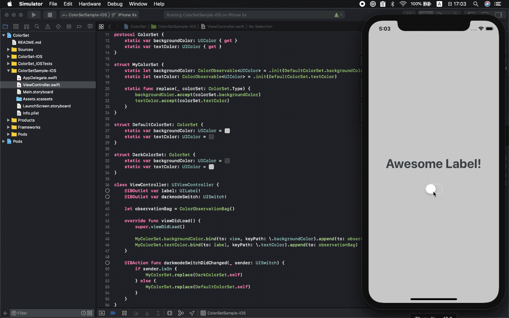

#  ColorSet

[](https://app.bitrise.io/app/388601b81b3a10f8)
[](https://developer.apple.com/swift)
[](https://opensource.org/licenses/MIT)

## Description

Change theme color of your apps.



## Usage

### Define your ColorSet

```swift
import ColorSet_iOS

protocol ColorSet {
    static var backgroundColor: UIColor { get }
    static var textColor: UIColor { get }
}

struct MyColorSet {
    static let backgroundColor: ColorObservable<UIColor> = .init(DefaultColorSet.backgroundColor)
    static let textColor: ColorObservable<UIColor> = .init(DefaultColorSet.textColor)

    static func replace(_ colorSet: ColorSet.Type) {
        backgroundColor.accept(colorSet.backgroundColor)
        textColor.accept(colorSet.textColor)
    }
}

struct DefaultColorSet: ColorSet {
    static var backgroundColor: UIColor = #colorLiteral(red: 0.8039215803, green: 0.8039215803, blue: 0.8039215803, alpha: 1)
    static var textColor: UIColor = #colorLiteral(red: 0.2549019754, green: 0.2745098174, blue: 0.3019607961, alpha: 1)
}

struct DarkColorSet: ColorSet {
    static var backgroundColor: UIColor = #colorLiteral(red: 0.2549019754, green: 0.2745098174, blue: 0.3019607961, alpha: 1)
    static var textColor: UIColor = #colorLiteral(red: 0.8039215803, green: 0.8039215803, blue: 0.8039215803, alpha: 1)
}
```

### Change color set

```swift
import UIKit
import ColorSet_iOS

class ViewController: UIViewController {

    @IBOutlet weak var label: UILabel!
    @IBOutlet weak var darkmodeSwitch: UISwitch!

    let observationBag = ColorObservationBag()

    override func viewDidLoad() {
        super.viewDidLoad()

        MyColorSet.backgroundColor.bind(to: view, keyPath: \.backgroundColor).append(to: observationBag)
        MyColorSet.textColor.bind(to: label, keyPath: \.textColor).append(to: observationBag)
    }

    @IBAction func darkmodeSwitchDidChanged(_ sender: UISwitch) {
        if sender.isOn {
            MyColorSet.replace(DarkColorSet.self)
        } else {
            MyColorSet.replace(DefaultColorSet.self)
        }
    }
}
```
